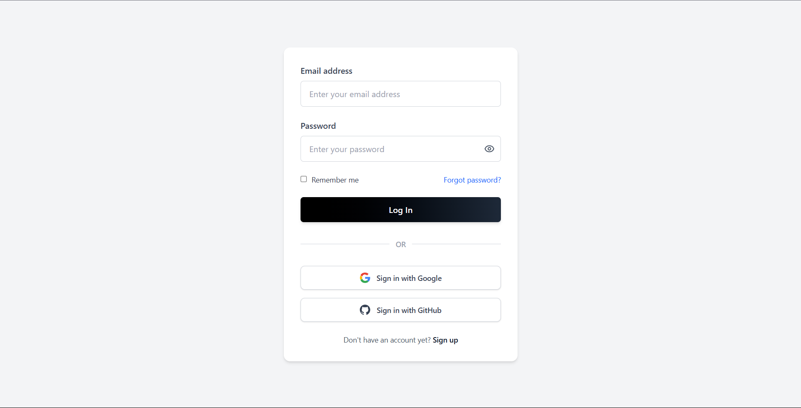

# Auth Frontend

A modern React frontend for the Fullstack Authentication System. Provides a clean, responsive UI for user authentication, registration, OAuth, and role-based dashboards.

---

## 🛠️ Tech Stack & Dependencies

- React (Vite)
- Axios
- React Router DOM
- Context API
- ESLint

---

## 🚀 Getting Started

### 1. Install dependencies

```bash
npm install
```

### 2. Environment Variables

Create a `.env` file in `auth-frontend/` (if needed):

```env
VITE_API_URL=http://localhost:5000/api
```

### 3. Run the app

#### Development

```bash
npm run dev
```

#### Production

```bash
npm run build
npm run preview
```

---

## 📁 Folder Structure

```
auth-frontend/
├── public/             # Static assets
├── src/
│   ├── assets/         # Images, SVGs
│   ├── components/     # Reusable UI components
│   ├── context/        # React Context (Auth)
│   ├── pages/          # Page components (Login, Signup, etc.)
│   ├── routers/        # Route definitions
│   ├── services/       # API service modules
│   ├── App.jsx         # Main app component
│   ├── main.jsx        # Entry point
│   └── ...             # Styles, etc.
├── package.json
├── vite.config.js
└── README.md
```

---

## 🧩 Component Structure

- **components/**: Loader, GoogleLogin, GitHubLogin, PageNotFound, PrivateRoute, etc.
- **pages/**: Home, Login, Signup, ForgotPassword, VerifyOtp, admin/moderator dashboards.
- **context/**: AuthContext for global auth state.
- **routers/**: Route guards and app routes.

---

## 🖼️ Screenshots / Design Previews

Below are actual UI screens. Images are sourced from `src/assets/screenshots/`:

### Signup


_Signup page_

---

### Signin


_Signin page_

---

### Admin Panel


_Admin dashboard_

> _Add screenshots or a demo link above. Place your images in the `screenshots/` folder._

---

## 📝 License

MIT

---

## 👤 Author

- **Darshan Bhattarai**
- [darshan.bhattarai@email.com](mailto:darshan.bhattarai@email.com)
